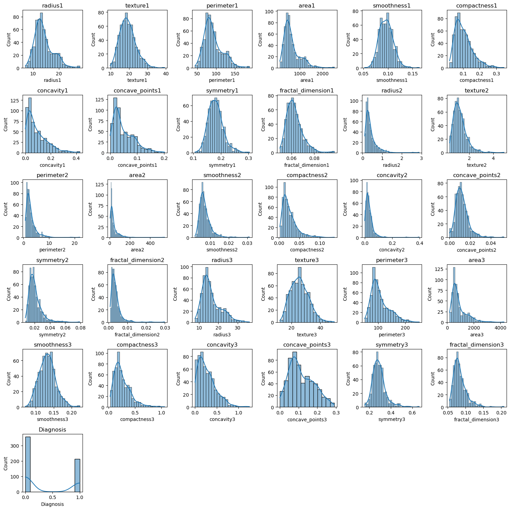
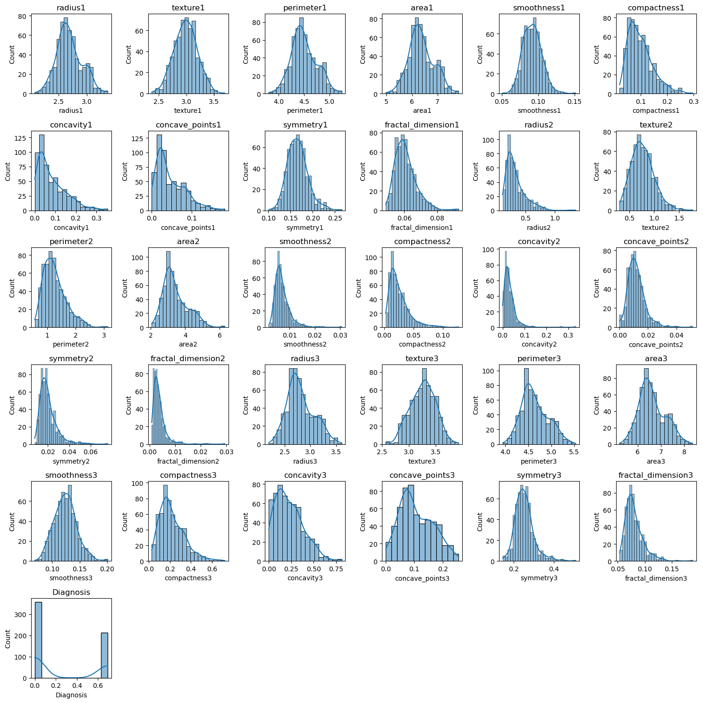
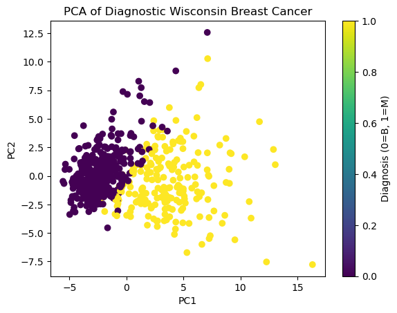

# 🧬 Breast Cancer Dataset Analysis

## 📌 Overview
This project analyzes the **Breast Cancer Wisconsin Diagnostic Dataset** to explore patterns between malignant and benign tumors.  
It applies **Python** with **Pandas**, **Matplotlib**, and **Seaborn** to perform:
- Data exploration
- Feature analysis
- Dimensionality reduction (PCA)
- Visualizations for insights

---

## 🚀 Usage
1. Open the notebook (`breast_cancer_analysis.ipynb`) in **Jupyter Notebook** or **JupyterLab**.  
2. Run the cells sequentially to:  
   - Load and clean the dataset (`New_file.csv`)  
   - Perform exploratory data analysis (EDA)  
   - Generate visualizations and insights  

---

## 📊 Results
Below are some output images generated from the analysis:

### 🔹 Feature Distribution(Before)

### 🔹 Feature Distributions(After Log Transformation)

### 🔹 PCA Scatter Plot

---

## 📝 Conclusion
- The dataset contains **569 samples** with **30 numerical features** and one target (`Diagnosis`).  
- After **feature scaling and PCA**, we observe a **clear separation** between benign and malignant tumors in the first two principal components.  
- Certain features such as **radius, texture, concavity, and smoothness** show strong variance between the two classes.  
- This dataset is highly suitable for **binary classification tasks**, and can be effectively modeled with algorithms like:
  - Logistic Regression  
  - Support Vector Machines (SVM)  
  - Random Forest  
  - Neural Networks  

✅ Overall, the dataset provides a strong foundation for **medical ML research**, especially in building models for **early cancer detection**.

---

💡 *Feel free to fork this repo and try your own experiments with the Breast Cancer dataset!*
